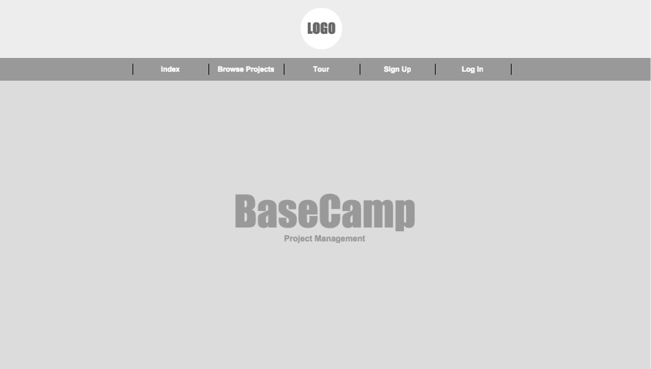
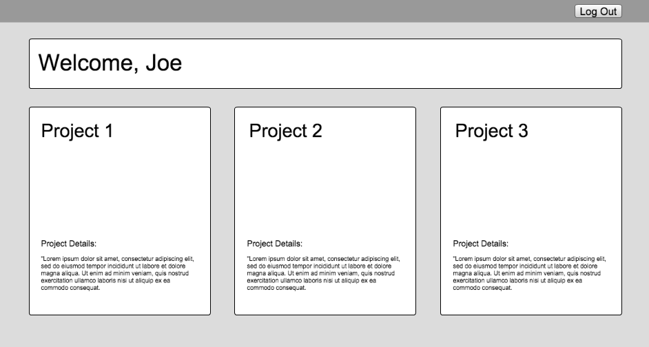
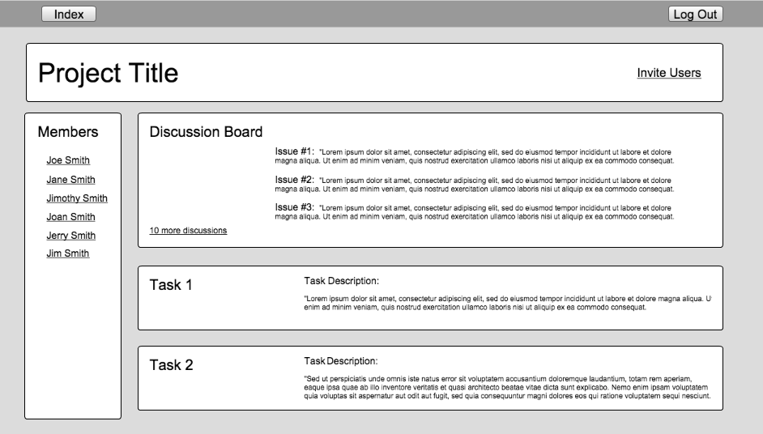

# View Wireframes

## Home Page

## User Show Page

## Project Show Page

<!-- ## New Session
![new-session]

## Feed Show (landing page)
![feed-show]

## Blog Show
![blog-show]

## Post Show
![post-show]

## Post Form
![post-form]

## Search Results
![search-results]

[new-session]: ./wireframes/new_session.png
[feed-show]: ./wireframes/feed_show.png
[blog-show]: ./wireframes/blog_show.png
[post-show]: ./wireframes/post_show.png
[post-form]: ./wireframes/post_form.png
[search-results]: ./wireframes/search_results.png
 -->

<!--  

  
<%= image_tag "logo.png", class: "logo-image" %>

 -->

<!-- 
    <ol class="carousel-indicators">
      <li data-target="#myCarousel" data-slide-to="0" class="active"></li>
      <li data-target="#myCarousel" data-slide-to="1"></li>
      <li data-target="#myCarousel" data-slide-to="2"></li>
    </ol> --> 